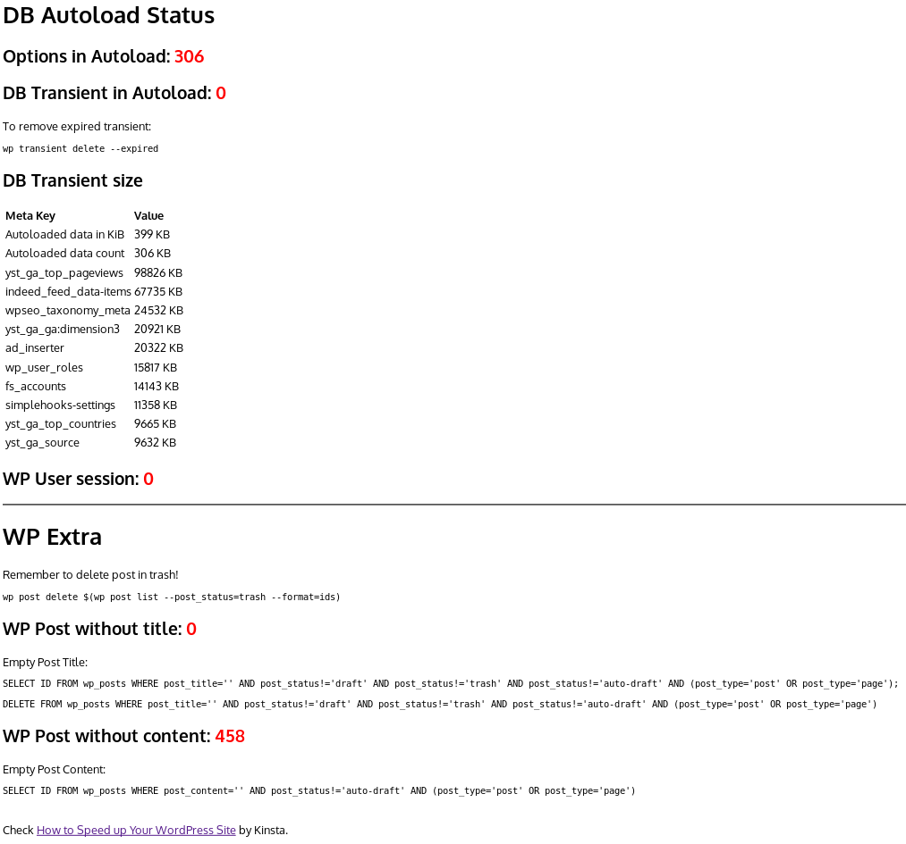

# WordPress Database Status

A simple drop script in the WP root folder to check the status of the database with SQL commands or WP CLI to cleanup.  

 

## Why

This script started after reading the [Kinsta](https://kinsta.com/learn/speed-up-wordpress/) guide and discover hints to improve the DB in production easily.